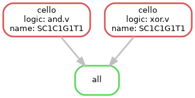

# cello2
3d semester, biotechnology seminar: cello-2 practice

Students:
* Maria Firulyova
* Elizaveta Grigoryeva

Tutor:
Alexander Tkachenko

Master's program webpage: https://ctlab.itmo.ru/bioinf-master/

## Installation

To run the pipeline, install cello-2 with all prerequisites:

* [Link to the installation instructions](https://github.com/CIDARLAB/Cello-v2#option-2-prepackaged-jar-file)
* [Snakemake](https://anaconda.org/bioconda/snakemake)

## Config structure

After installation, fill the `config.yaml` file with your pathes:

* `app_path` -- path to the cello2-jar file
* `data_path` -- path with json input data
* `logic_path` -- path with logic files
* `targets` -- basename(s) of target files (unique prefixes for UCF files in `data_path` folder)

## Pipeline structure



## Execution


```{commandline}
snakemake --cores 2
```

## Results

Check `output/target/logic` folders for results, e.g., if target was `SC1C1G1T1` and logic was `xor`,
check `output/SC1C1G1T1/xor.v` folder.

## References

* Article: https://www.nature.com/articles/s41564-020-0757-2
* Useful explanation: [link](https://www.youtube.com/watch?v=lNttxYdGHs4&ab_channel=iBiologyTechniques)